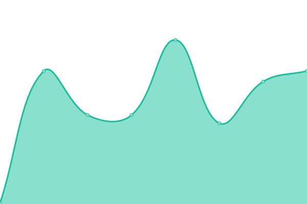
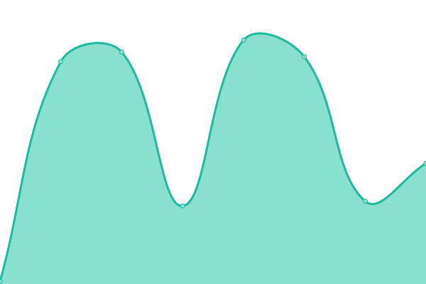
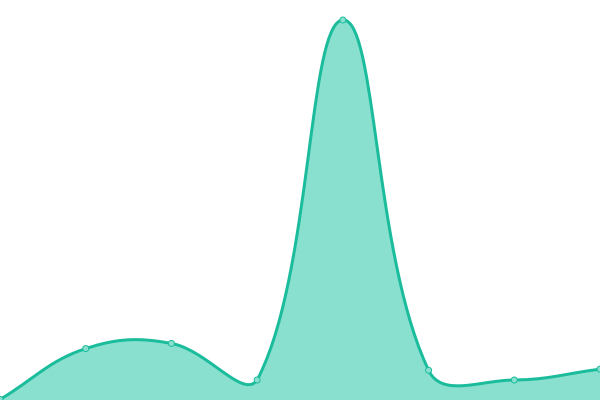
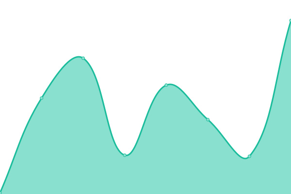
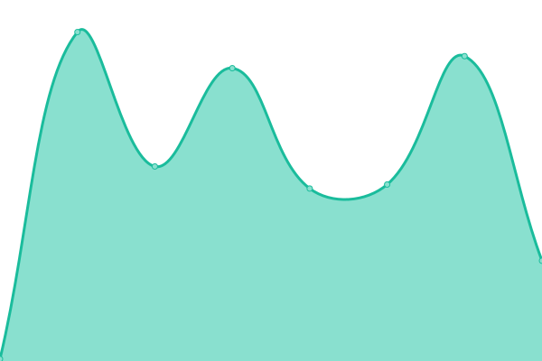

# [📈 Live Status](https://dstroot.github.io/vds_uptime): <!--live status--> **🟩 All systems operational**

This repository contains the open-source uptime monitor and status page for [Dan Stroot](https://danstroot.com), powered by [Upptime](https://github.com/upptime/upptime).

With [Upptime](https://upptime.js.org), you can get your own unlimited and free uptime monitor and status page, powered entirely by a GitHub repository. We use [Issues](https://github.com/dstroot/VDS_uptime/issues) as incident reports, [Actions](https://github.com/dstroot/VDS_uptime/actions) as uptime monitors, and [Pages](https://dstroot.github.io/VDS_uptime) for the status page.

<!--start: status pages-->
<!-- This summary is generated by Upptime (https://github.com/upptime/upptime) -->
<!-- Do not edit this manually, your changes will be overwritten -->
<!-- prettier-ignore -->
| URL | Status | History | Response Time | Uptime |
| --- | ------ | ------- | ------------- | ------ |
|  [Verite Data Science](https://veritedatascience.com/) | 🟩 Up | [verite-data-science.yml](https://github.com/dstroot/vds_uptime/commits/HEAD/history/verite-data-science.yml) | 

 109ms
     
 | 

<a href="https://dstroot.github.io/vds_uptime/history/verite-data-science">100.00%</a>
    

|  [Verite Data Science (Netlify)](https://modest-turing-778882.netlify.app/) | 🟩 Up | [verite-data-science-netlify.yml](https://github.com/dstroot/vds_uptime/commits/HEAD/history/verite-data-science-netlify.yml) | 

 79ms
     
 | 

<a href="https://dstroot.github.io/vds_uptime/history/verite-data-science-netlify">100.00%</a>
    

|  [React Instagram](https://affectionate-aryabhata-c22561.netlify.app/) | 🟩 Up | [react-instagram.yml](https://github.com/dstroot/vds_uptime/commits/HEAD/history/react-instagram.yml) | 

 101ms
     
 | 

<a href="https://dstroot.github.io/vds_uptime/history/react-instagram">100.00%</a>
    

|  [Storybook](https://zealous-fermat-ea58fd.netlify.app/) | 🟩 Up | [storybook.yml](https://github.com/dstroot/vds_uptime/commits/HEAD/history/storybook.yml) | 

 131ms
     
 | 

<a href="https://dstroot.github.io/vds_uptime/history/storybook">100.00%</a>
    

|  [React Infinite Scrolling](https://modest-panini-61a8ce.netlify.app/) | 🟩 Up | [react-infinite-scrolling.yml](https://github.com/dstroot/vds_uptime/commits/HEAD/history/react-infinite-scrolling.yml) | 

 103ms
     
 | 

<a href="https://dstroot.github.io/vds_uptime/history/react-infinite-scrolling">100.00%</a>
    

|  [React Dark Mode (Cloudflare)](https://react-darkmode.burley.workers.dev/) | 🟩 Up | [react-dark-mode-cloudflare.yml](https://github.com/dstroot/vds_uptime/commits/HEAD/history/react-dark-mode-cloudflare.yml) | 

 257ms
     
 | 

<a href="https://dstroot.github.io/vds_uptime/history/react-dark-mode-cloudflare">100.00%</a>
    

|  [Dan Stroot's Blog](https://danstroot.com/) | 🟩 Up | [dan-stroot-s-blog.yml](https://github.com/dstroot/vds_uptime/commits/HEAD/history/dan-stroot-s-blog.yml) | 

 184ms
     
 | 

<a href="https://dstroot.github.io/vds_uptime/history/dan-stroot-s-blog">100.00%</a>
    

|  [Site Monitor](https://dstroot.github.io/vds_uptime/) | 🟩 Up | [site-monitor.yml](https://github.com/dstroot/vds_uptime/commits/HEAD/history/site-monitor.yml) | 

 57ms
     
 | 

<a href="https://dstroot.github.io/vds_uptime/history/site-monitor">100.00%</a>
    

|  [Pacific Life](https://www.pacificlife.com/) | 🟩 Up | [pacific-life.yml](https://github.com/dstroot/vds_uptime/commits/HEAD/history/pacific-life.yml) | 

 508ms
     
 | 

<a href="https://dstroot.github.io/vds_uptime/history/pacific-life">100.00%</a>
    

<!--end: status pages-->

[**Visit our status website →**](https://dstroot.github.io/VDS_uptime)

## 📄 License

- Powered by: [Upptime](https://github.com/upptime/upptime)
- Code: [MIT](./LICENSE) © [Dan Stroot](https://danstroot.com)
- Data in the `./history` directory: [Open Database License](https://opendatacommons.org/licenses/odbl/1-0/)
